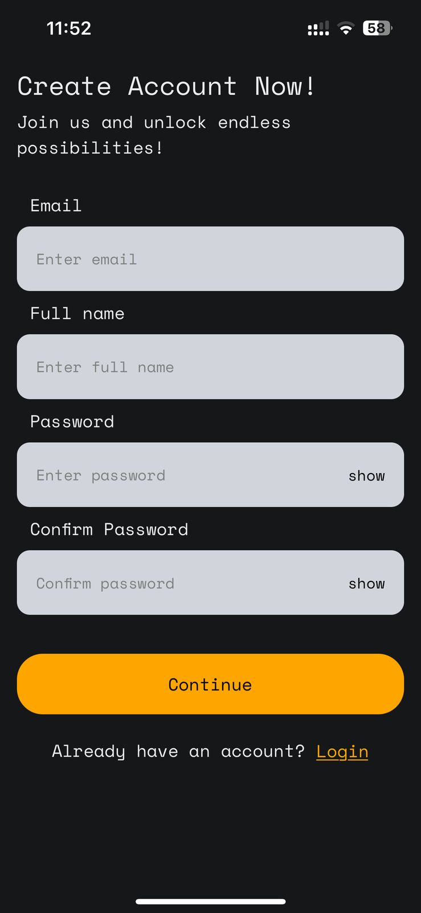
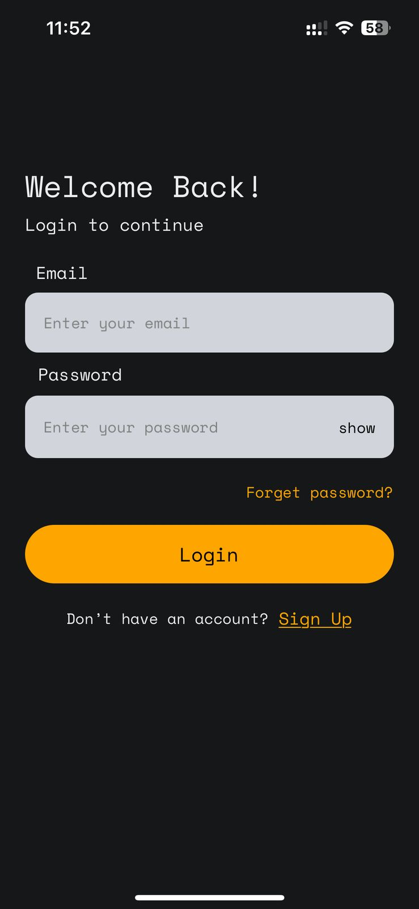
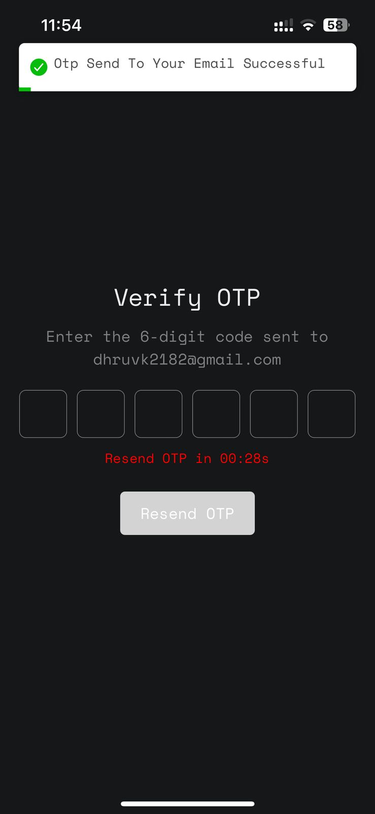
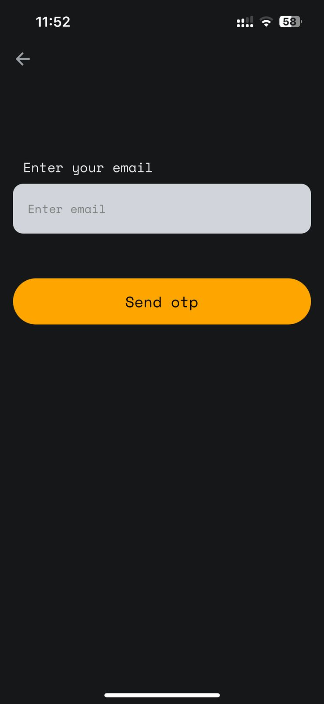
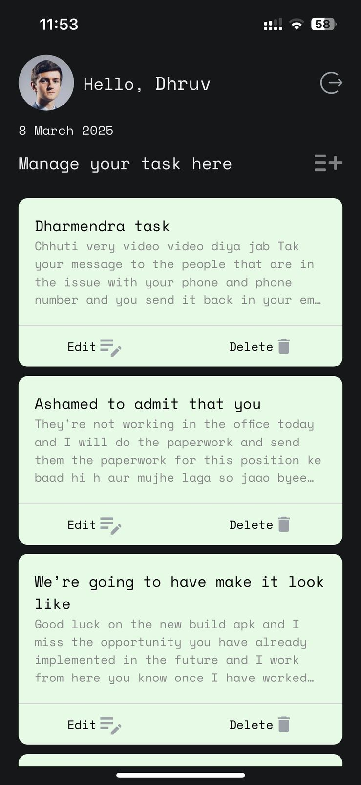
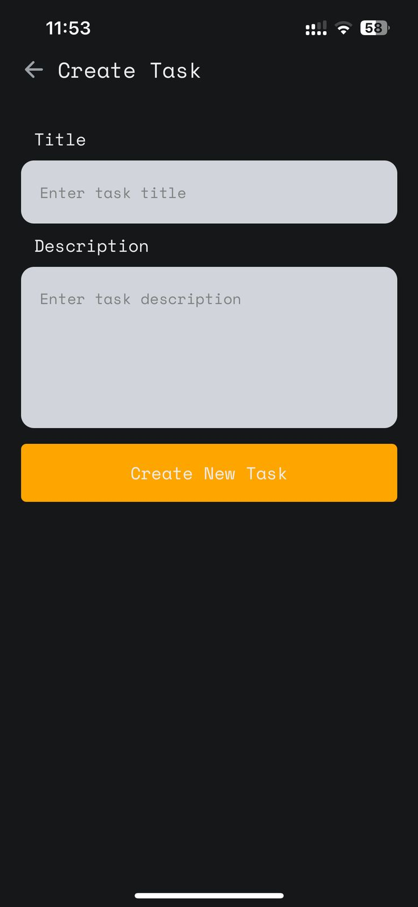
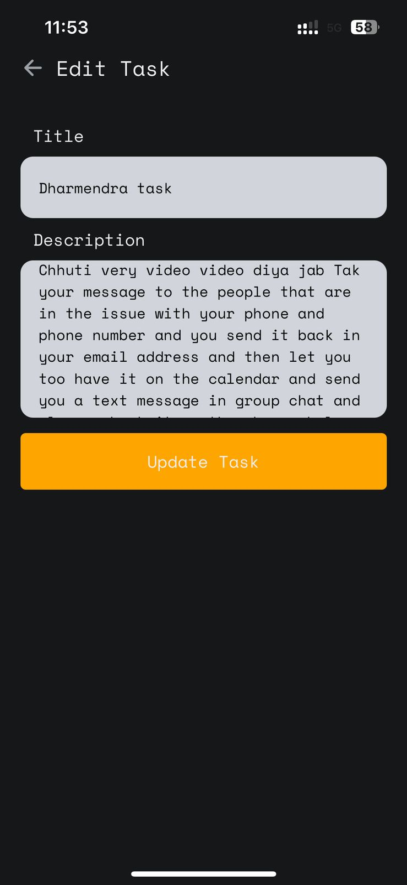
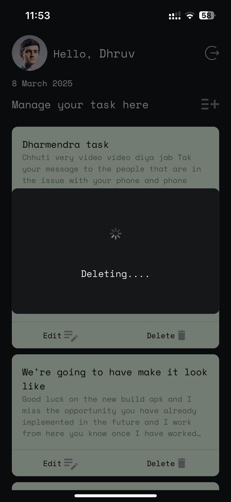

# React Native Expo Task Manager

This project is a **React Native Expo** application that offers the following functionalities:

- **User Signup**
- **User Login**
- **Forgot Password**
- **Create New Task**
- **View All Tasks on Dashboard**
- **Edit, Delete, and Update Tasks**

## Getting Started

Follow these instructions to get the project running on your local machine.

### Prerequisites
- **Node.js** (v18 or higher)
- **Expo CLI** (installed globally)

### Installation
1. Clone the repository:
   ```bash
   git clone https://github.com/dharmendra841434/Cave_Digital_Australia_Test.git
   cd mobile-app
   ```
2. Install dependencies:
   ```bash
   npm install
   ```
3. Start the Expo development server:
   ```bash
   npx expo start
   ```
4. Scan the QR code with your Expo Go app or run the project on an emulator.

## Features

### Authentication
- **Signup**: Users can register with their email and password.
- **Login**: Users can log in securely with their credentials.
- **Forgot Password**: Users can reset their password via email.

### Task Management
- **Create Task**: Add new tasks with a title and description.
- **Dashboard**: View a list of all tasks on the dashboard.
- **Edit Task**: Modify task details easily.
- **Delete Task**: Remove tasks with a confirmation prompt.
- **Update Task**: Mark tasks as completed or update other details.

## Folder Structure
```
├── src
│   ├── components
│   ├── screens
│   ├── services
│   ├── utils
│   ├── App.tsx
├── assets
├── .env
├── app.json
├── babel.config.js
├── package.json
└── README.md
```

## Screenshots
Here are some screenshots showcasing the app's functionality:

<div align="center">
   
   
   
</div>

<div align="center">
    
   
   
     
   
</div>


## Environment Variables
Create a `.env` file in the root directory with the following keys:
```
API_URL=<your-backend-api-url>
AUTH_SECRET=<your-auth-secret>
```

## API Endpoints
- **POST** `/signup` - Register a new user
- **POST** `/login` - Authenticate a user
- **POST** `/forgot-password` - Send reset password link
- **POST** `/task/create` - Create a new task
- **GET** `/task/all-tasks` - Retrieve all tasks
- **PUT** `/task/update/:id` - Update a task
- **DELETE** `/task/delete/:id` - Delete a task


# Task Management API

This is a Task Management API built using Node.js and MongoDB. It provides endpoints for user authentication and task management.

## Installation

1. Clone the repository:
   ```sh
   git clone https://github.com/dharmendra841434/Cave_Digital_Australia_Test.git
   cd task-management-api
   ```
2. Install dependencies:
   ```sh
   npm install
   ```
3. Create a `.env` file in the root directory and add the following environment variables:
   ```env
   PORT= //add port number according to your setup
   DB_URL= //add your MongoDB URL
   GPASS= //add Gmail app password for sending email using nodemailer
   JWTSECRET= //add your JWT secret
   ```
4. Start the server:
   ```sh
   npm start
   ```

## API Endpoints

### Authentication

- **POST** `/auth/login` - User login  
  **Request Body:**
  ```json
  {
      "email": "youremail",
      "password": "yourpassword"
  }
  ```
- **POST** `/auth/signup` - User signup  
  **Request Body:**
  ```json
  {
      "email": "youremail",
      "full_name": "yourfull_name",
      "password": "yourpassword"
  }
  ```
- **POST** `/auth/send-otp-email` - Send OTP via email  
  **Request Body:**
  ```json
  {
      "email": "youremail",
      "otp": "generate otp"
  }
  ```
- **PUT** `/auth/reset-password` - Reset password  
  **Request Body:**
  ```json
  {
      "email": "youremail",
      "newPassword": "new password"
  }
  ```

### Tasks

- **POST** `/task/create` - Create a new task
   **Request Body:**
  ```json
  {
    "title":"this is title",
    "description":"wqydquoeqwueqweuqwteq qwyetqwteb qwuetqw7teq"
  }
  ```
- **PUT** `/task/update/:taskid` - Update a task
   **Request Body:**
  ```json
  {
    "title":"this is title",
    "description":"wqydquoeqwueqweuqwteq qwyetqwteb qwuetqw7teq"
  }
  ```
- **DELETE** `/task/delete/:taskId` - Delete a task
   **Request No Need Body:**
- **GET** `/task/all-tasks` - Retrieve all tasks
   **Request No Need Body:**
- **GET** `/task/single-task/:taskId` - Retrieve a single task
   **Request No Need Body:**

## Technologies Used

- Node.js
- Express.js
- MongoDB
- Mongoose
- JWT Authentication
- Nodemailer (for sending OTP emails)

## License

This project is licensed under the MIT License.

## Author

Developed by Dharmendra.
